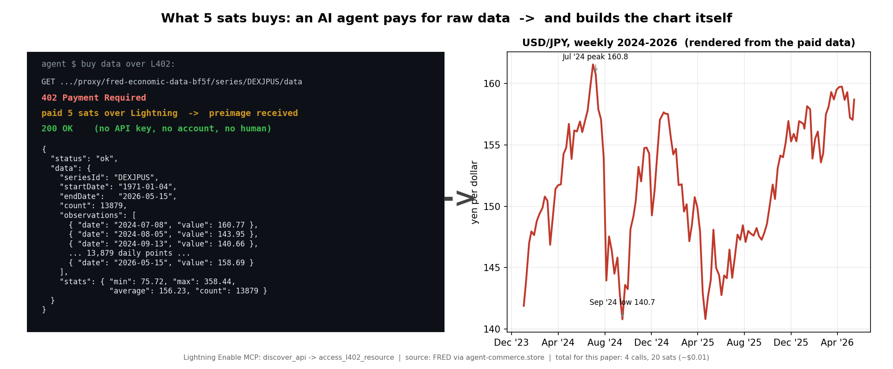

# l402-research-agent

This repo shows an AI agent discovering, purchasing, and using real market data over L402, per call, with no API keys, no accounts, and no human payment step. **Total cost: 20 sats.**



*Left: the raw FRED data the agent paid 5 sats for, over L402. Right: the chart it built from that exact data. No API key, no account, no human in the payment loop.*

## What this is

A reproducible demonstration of **agentic commerce**. Given a topic and a small budget, an AI agent autonomously:

1. **discovered** the data sources it needed,
2. **paid** for each one per call over the **L402** protocol (HTTP `402 Payment Required` + a Lightning preimage),
3. **analyzed** the raw data and rendered its own charts, and
4. **wrote** a cited research paper — **[The Yen Carry Trade and Its Unwind](yen-carry-unwind-paper.md)**.

No human entered a payment. No FRED account, no API key, no signup. The agent paid for exactly the data it needed, when it needed it — the kind of account-less, sub-cent, per-call transaction the card/Stripe/API-key economy can't do.

## The receipt

| | |
|---|---|
| Data calls | 4 (FRED, via agent-commerce.store) |
| Series | USD/JPY, Nikkei 225, VIX, US 10-Year yield |
| Cost | 5 sats each = **20 sats (~US$0.01)** |
| API keys / accounts / human approvals | **0 / 0 / 0** |
| Token | L402 macaroon, path-scoped, ~60-min TTL |

Per-call payment record: [`data/_receipt.json`](data/_receipt.json).

## The output

**→ [The Yen Carry Trade and Its Unwind: Anatomy of a 2024 Shock](yen-carry-unwind-paper.md)** — a ~1,050-word analysis with four charts, every figure traceable to data the agent paid for.

Because it used *real* data, it caught a distinction a vibes-based take would miss: the window's most extreme equity/volatility readings (the Nikkei low, the VIX high) were the **April-2025 tariff shock**, not the **August-2024 carry unwind**. The paper keeps them separate.

## Run it yourself

You need an AI agent connected to the **[Lightning Enable MCP server](https://github.com/refined-element/lightning-enable-mcp)** with a funded Lightning wallet. Then give it this prompt:

> Write a well-researched, cited post on the yen carry-trade unwind. Using up to 25 sats from my wallet, discover the FRED data on agent-commerce.store (via the `discover_api` tool on the Lightning Enable MCP server) and pull what you need — USD/JPY, the Nikkei 225, the VIX, and the US 10-year Treasury yield — to support the analysis with real figures, charts, and citations. Then use a journalist agent to write the paper, distinguishing the August-2024 carry unwind from any later shocks the data reveals.

Full prompt + methodology notes: [`prompt.md`](prompt.md).

## How it works (per data call)

```
discover_api("finance")              -> finds FRED on agent-commerce.store
GET  /series/DEXJPUS/data            -> 402 Payment Required + Lightning invoice
pay 5 sats over L402                 -> preimage
GET  /series/DEXJPUS/data  (L402)    -> 200 OK + structured JSON
```

The Lightning Enable MCP handles the `402 -> pay -> retry` cycle automatically via `access_l402_resource`.

## Tooling

- **Lightning Enable MCP** (open source, MIT) — the agent's payment + discovery tools (`discover_api`, `access_l402_resource`, `pay_l402_challenge`, and ~20 more): <https://github.com/refined-element/lightning-enable-mcp>
  - NuGet: `LightningEnable.Mcp` · PyPI: `lightning-enable-mcp` · Docker: `refinedelement/lightning-enable-mcp`
- **Agent Commerce Store** — the L402 API marketplace the data came from (data APIs + bundled suites, all pay-per-call, no keys): <https://agent-commerce.store>
- **Lightning Enable API**: <https://api.lightningenable.com>
- **L402** — the HTTP-402 + Lightning auth protocol: <https://github.com/lightninglabs/L402>

## What's in here

- [`yen-carry-unwind-paper.md`](yen-carry-unwind-paper.md) — the paper.
- [`charts/`](charts) — the four charts and four "paid-for-this -> built-this" proof panels.
- [`data/`](data) — the datasets extracted from each paid call, plus `_receipt.json`.
- [`prompt.md`](prompt.md) — the reproducible prompt and methodology notes.

## Data, credit, license

Market data: **FRED** (Federal Reserve Economic Data), retrieved via agent-commerce.store's L402 proxy. Trigger context: **Bank of Japan**, July 31 2024 monetary policy decision. The underlying economic data is public-domain; the text and code in this repository are MIT-licensed.
