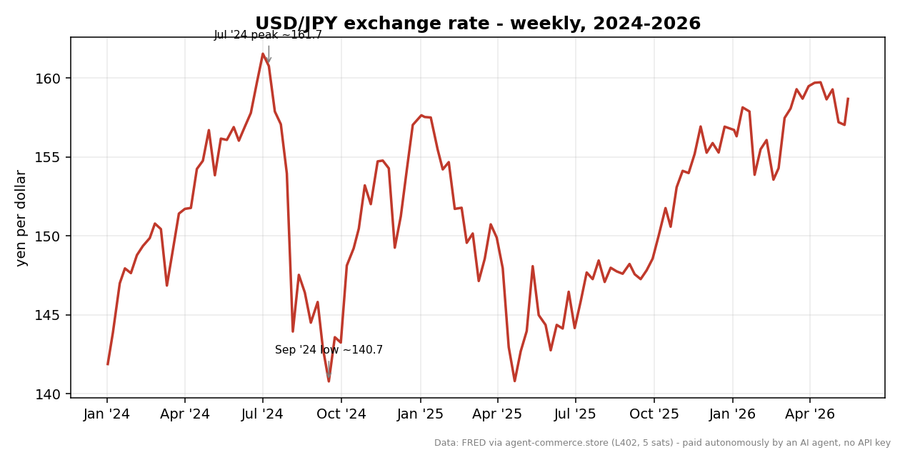
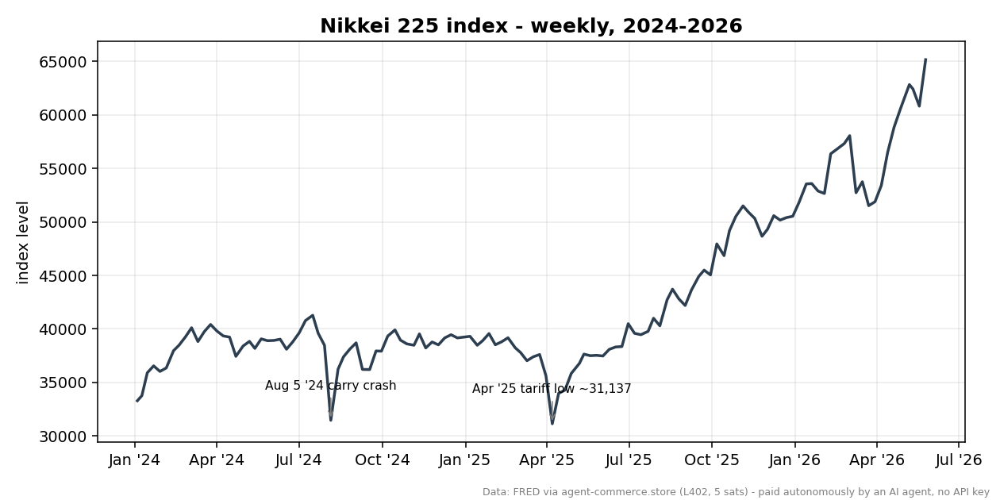
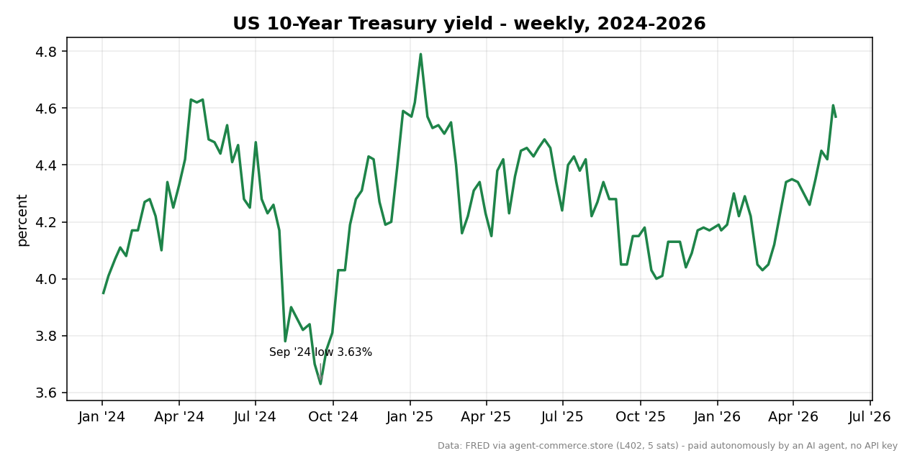
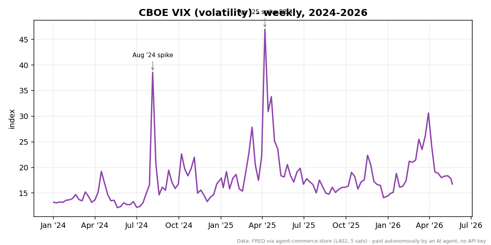

# The Yen Carry Trade and Its Unwind: Anatomy of a 2024 Shock

For a few days in early August 2024, the cheapest money in the world stopped being cheap, and global markets convulsed. On August 5, the Nikkei 225 fell roughly 12.4% in a single session, the largest point drop in its history. Volatility gauges in the United States spiked to levels normally reserved for genuine crises. The trigger was not a bank failure or a war. It was a quarter-point interest-rate hike in Tokyo, layered on top of shifting expectations in Washington, that quietly pulled the rug out from under one of the most popular leveraged trades on the planet: the yen carry trade.

This piece walks through what that trade was, why it worked for so long, what broke it, and why the most violent equity and volatility readings of the past two years actually belong to a *different* episode entirely.

## What the carry trade was, and why it worked

A carry trade is one of the oldest ideas in finance: borrow where money is cheap, invest where it pays more, and pocket the difference. For more than a decade, Japan offered the cheapest money in the developed world. The Bank of Japan held its policy rate at or below zero, while the rest of the world — especially the United States after 2022 — paid materially higher rates.

The mechanics were straightforward. A fund could borrow yen at near-zero cost, convert that yen into dollars, and buy higher-yielding assets: US Treasuries, US and Japanese equities, even other currencies. As long as the interest-rate gap held and the yen stayed weak or kept weakening, the trade printed money on two fronts at once — the rate differential *and* the currency move.

*USD/JPY exchange rate, yen per dollar (FRED: DEXJPUS). Higher means a weaker yen. The rate ran from 141.89 at the start of 2024 to a multi-decade low of 160.77 on July 8, 2024 — the peak of the carry trade.*

That second leg is why a weak yen mattered so much. As the yen slid from 141.89 per dollar at the start of 2024 to 160.77 by July 8 — a multi-decade low — every dollar-denominated asset a yen-funded trader held became worth more yen on paper. The currency was working for the trade. The same dynamic propelled Japanese equities: the Nikkei 225 climbed from 33,288 in early January 2024 to a peak of 40,781 on July 8, the same day the yen bottomed. A cheap yen flatters Japanese exporters' earnings and draws foreign capital into Tokyo-listed stocks. Everything was pointing the same direction, and leverage amplified all of it.

*Nikkei 225 index level (FRED: NIKKEI225). The index peaked at 40,781 on July 8, 2024, then fell to 31,458 in the August 5 carry-unwind crash week before recovering toward 36,203 by mid-September.*

## What broke it

The carry trade depended on one thing above all: the gap between Japanese and US interest rates staying wide. In late July 2024, both ends of that gap moved at once, and they moved toward each other.

On July 31, 2024, the Bank of Japan raised its policy rate to around 0.25% — its first meaningful hike in years — and signaled a willingness to keep tightening. At the same time, US data was softening and markets were rapidly pricing in Federal Reserve rate cuts. The US 10-year Treasury yield, which had stood at 4.28% on July 8, fell to 3.78% by August 5 and kept sliding to 3.63% by mid-September as cut expectations built. Tokyo was raising the cost of yen funding just as Washington looked set to lower the return on the dollar assets that funding bought.

*US 10-Year Treasury yield, percent (FRED: DGS10). The yield slid from 4.28% on July 8, 2024 to 3.63% by mid-September as Fed-cut expectations narrowed the US–Japan rate differential the carry trade depended on.*

The squeeze worked from both sides. A narrower differential made the trade less profitable to hold, and a strengthening yen made it actively dangerous: the same currency leverage that had magnified gains now magnified losses. As traders rushed to close positions, they had to buy back yen, which pushed the yen up further, which forced still more traders to cover — a classic reflexive unwind feeding on itself.

## The unwind

The reversal was fast. From its July 8 low of 160.77 per dollar, the yen surged to 143.95 by August 5 and kept strengthening to 140.66 by September 13 — its strongest level of the period. In FX terms, that is an enormous move in a matter of weeks, and it is the defining signature of this episode.

The equity and volatility reaction was concentrated and brutal. The Nikkei 225 collapsed from its July peak to 31,458 during the August 5 crash week, with that single session down roughly 12.4% — the largest point drop in the index's history. In the United States, the CBOE VIX, which had sat at a placid 12.37 on July 8, spiked to 38.57 on August 5 and reportedly touched around 65 intraday, a reading consistent with acute, forced deleveraging rather than a considered repricing of fundamentals.

*CBOE Volatility Index (FRED: VIXCLS). From 12.37 on July 8, 2024 the VIX spiked to 38.57 on August 5 (intraday reportedly ~65) during the carry unwind, then normalized to 17.14 by mid-September.*

What stands out is how quickly it resolved. By September 16–17, the VIX had fallen back to 17.14, the Nikkei had recovered to 36,203, and the 10-year yield had settled at 3.63%. The unwind was violent but not structurally damaging; it looked far more like a liquidation cascade in a crowded trade than a solvency event. Within roughly six weeks, the most acute phase was over.

## What it was *not*

It is tempting to attach every dramatic 2024–2026 market reading to the carry unwind, but the data argues against that. The most extreme equity and volatility prints in this window did not occur in August 2024 at all. They came in April 2025, during a separate tariff shock.

In that later episode, the VIX reached 52.33 on April 8, 2025 — higher than anything seen during the carry unwind — and the Nikkei 225 fell to 31,137 on April 7, the absolute low of the entire window. The US 10-year yield had earlier reached its window high of 4.79% on January 13, 2025, in a different rate regime altogether. These were driven by trade-policy fears, not by yen funding costs. Conflating the two would misread both. The carry unwind's fingerprint was in *foreign exchange* — the speed and scale of the yen's surge — and in the breathtaking velocity of the early-August equity drop, not in the absolute index lows, which belong to 2025.

## Aftermath: where we are now

The carry-trade unwind, for all its drama, proved to be a clearing event rather than a turning point. Positioning that had grown dangerously crowded was flushed out, the yen found a new range, and risk appetite returned. The yen has since weakened again, trading at 158.69 per dollar as of mid-May 2026, not far from its 2024 lows — a reminder that the structural rate gap, while narrower, did not vanish.

Equities have gone considerably further. The Nikkei 225 reached a record 65,158 on May 25, 2026, well above its 2024 peak, while the VIX sat at a calm 16.76 in late May 2026 and the 10-year yield held at 4.57%. The episode that felt existential in August 2024 now reads, with the benefit of two years, as a sharp but contained deleveraging — painful for those who were leveraged into it, and largely a footnote for everyone who waited a quarter.

## Close

The yen carry unwind is a useful reminder that the most dangerous trades are often the most comfortable ones. A position that profits quietly for years, on both the rate and the currency, accumulates participants and leverage precisely because it feels safe — until a modest policy shift on one side of the world forces all of them toward the exit at once. The numbers from August 2024 are the receipt for that lesson.

---

## Sources

- **Bank of Japan**, Monetary Policy Decision, July 31, 2024 (policy rate raised to ~0.25%) — the trigger for the unwind.
- **USD/JPY exchange rate** — FRED series **DEXJPUS** (Japanese yen per US dollar), Board of Governors of the Federal Reserve System.
- **Nikkei 225 index** — FRED series **NIKKEI225**.
- **CBOE Volatility Index (VIX)** — FRED series **VIXCLS**, Chicago Board Options Exchange.
- **US 10-Year Treasury Constant Maturity yield** — FRED series **DGS10**, Board of Governors of the Federal Reserve System.

All four FRED series were retrieved via agent-commerce.store's L402 proxy.

---

### Methodology / Colophon

The market data in this piece was acquired autonomously by an AI agent using the Lightning Enable MCP server. The agent discovered the data sources via the `discover_api` tool, then paid for each dataset per call over the L402 protocol — four calls to FRED via agent-commerce.store, 5 sats each, 20 sats (≈ US$0.01) total, with no API keys, no accounts, and no human in the payment loop.
